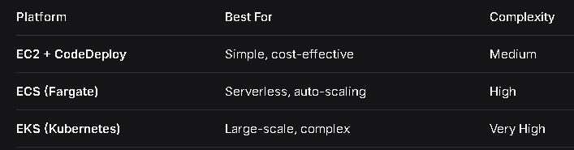

1. Project Overview
    - This is a Regression problem that has input features about rider, vehicle, weather conditions, traffic and pickup location and delivery location
    - Goal is to predict the delivery time.

2. Buisness use case
    - In competitive food delivery market, on-time delivery is critical for customer satisfaction, retention and operational efficiency. Companies want to optimize delivery time predictions to improve customer experience by providing accurate ETAs and to manage resource effectively. Accurate predictions of ETAs will help in:
    
    - improve delivery efficiency: by analyzing the actual reason behind the slow delivery business can improve it

    - enhance customer satisfaction 

    - optimize operational cost: when we know it can take more time then we can plan accordingly to reduce the delivery time 

3. Impact
    - Increase overall customer satisfaction as customer can plan based on ETA
    - Incrase customer trust when there is a transparency
    - It will reduce chances of order cancellations
    - Lower customer service calls or complaints when customer knows when they are actually going to recieve thier order
    - Dispatch team can plan and manage resources accordingly based on order ETAs
    - Can help companies impliment surge pricing in extreme weather or congestion events
    - Riders can plan pickup and deliveries accordingly in the same route
    - Can opt for other providers when demand is less to increase thier earnings
    - Restraunts can prioritize thier inhouse and delivery orders if delivery times are avaialble
    - Restraunts can scale staff and resources  during increased demand events

3. What metrics are best:
    - Since we are predicting time so we need to have same units and can have outliars also
    - These 2 are best as robust to outliars (doesnt penalize the outliars)
        - RMSE
        - MAE

4. Project Setup
    - Create a project folder
    - git init
    - dvc init -f
    - Create venv
    - pip install -r requirements.txt
    - Create github repo and add remote: git remote add origin <.git url>
    - Run template.py to create folder and files
    - Create setup.py and pip install -e .

5. Data Gathering

6. Data Assesment

7. Data Cleaning

5. EDA

6. Data Transformation & Feature Engineering

+ **Setup Below before moving to step 7**
+ dvc remote add -d myremote s3://my-mlops-project-demo/house_price_prediction
+ dvc config core.autostage true ---> auto pull everytime
+ Setup dagshub and host mlflow 

7. Model Training
    1. Baseline model
    2. Best Algorithm
    3. Hyper-parameter Tunining

+ **Setup Below before moving to step 8**
    1. S3 bucket for data versioning

8. Convert best overall into dvc pipeline: create components like data_ingestion, data_transformation, model_trainer, model_evalutaion, logger etc

9. Upload best model on dagshub hosted mlflow model_registry in staging 

10. Perform model test & if success then push model to production

11. Create fastapi (fetch latest model in production from mlflow model_registry and make predictions)

+ **Setup Below before moving to step 12**
    1. aws ecr for docker app
    2. create iam user
    3. attach policies
    4. setup aws: pip install awscli && aws configure (access key and security key)

12. Create CICD Pipeline which will do the following: 
    - To run dvc pipeline **on push**
    - Evaluate model
    - Upload best model on dagshub hosted mlflow model registry
    - Perform model and promote model to production
    - Dockerize fastapi which uses latest model in production
    - Push docker image to ECR

13. Enhance CICD Pipeline
    - For the deployment, Chose any 1 from below based on use case:

    

14. Monitoring and Retraining Pipeline
    - **Why**
        - Models degrade over time due to:
        - Data drift (changing delivery patterns)
        - Concept drift (new traffic rules, weather patterns)
        - Feature drift (new restaurants, rider behavior)

    - **Solution**
        - Continuous monitoring + automated retraining
        - Production Monitoring with **Prometheus & Grafana**
        - Send Notifications on Slack

